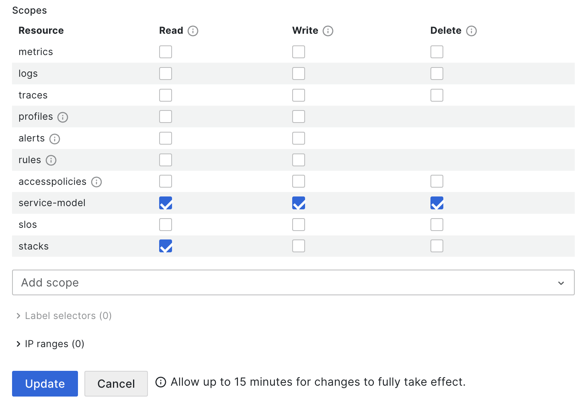
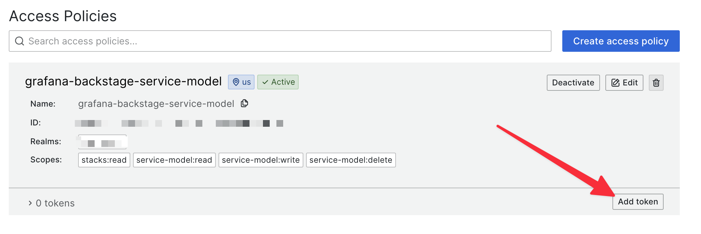

# Grafana Cloud Access Token

For the config section for this plugin, you need to provide:

- Your stack "slug"
- A Cloud Access Policy Token

The `stack_slug` is the name of your Grafana cloud stack. If you only have one stack, your org name will be the same as the stack slug.

In order to create a token, navigate to `https://grafana.com/orgs/<your org name>` select "Access Policies" on the left:

Next select "Create access policy":

Give your policy a memorable name.

Under "Realms" you MUST choose the stack you want this token for. _Note: You must select a single stack, not the whole org_, or this will not work.

Then add the "Scopes" for this policy. Select "Add Scope" to choose the following scopes:

You must include at least the following scopes:

- stacks:read
- service-model:read
- service-model:write
- service-model:delete

Your Policy should look like this in the end.

Click "Create"

Now you need to create a Token from this policy. Click on "Add Token", give it a name, an expiration time, and Create it.

Put this token in your `app-config.yaml` in the `token:` config item above.
