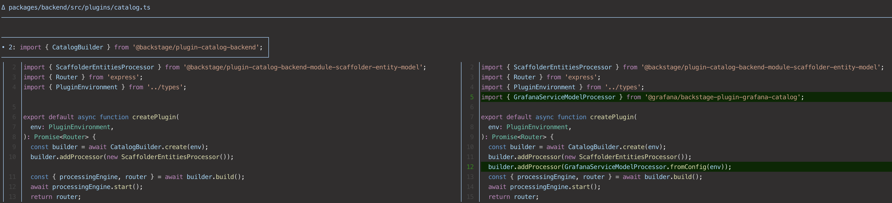

To install this plugin, from your backstage directory:

```bash
yarn add --cwd packages/backend @grafana/backstage-plugin-grafana-catalog
````

Add the following to `packages/backend/src/plugins/catalog.ts`



To configure the plugin, you need to add the following to an `app-config.yaml` of your choosing:

```
grafanaCloudConnectionInfo:
  stack_slug: <your stack slug>
  grafana_endpoint: https://grafana.com
  token: <Cloud Access Token>
```

The `stack_slug` is the name of your Grafana cloud stack. If you only have one stack, your org name will be the same as the stack slug.

In order to create a token, navigate to `https://grafana.com/orgs/<your org name>` select "Access Policies" on the left:


Next select "Create access policy":


Give your policy a memorable name.

Under "Realms" choose the stack you want this token for. *Note: You must select a single stack, not the whole org*, or this will not work.

Then add the "Scopes" for this policy. Select "Add Scope" to choose the following scopes:


You must include at least the following scopes:

- stacks:read
- service-model:read
- service-model:write
- service-model:delete


Your Policy should look like this in the end.


Click "Create".

Now you need to create a Token from this policy. Click on "Add Token", give it a name, an expiration time, and Create it.


Put this token in your `app-config.yaml` in the `token:` config item above.

